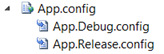
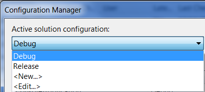
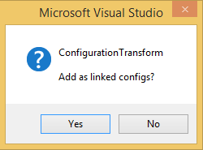
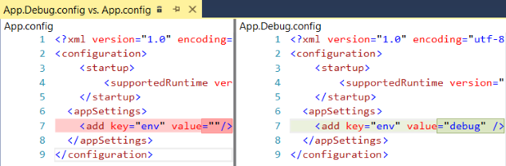

# ConfigurationTransform

[](https://dev.azure.com/golavr/ConfigurationTransform/_build/latest?definitionId=4&branchName=master)
[](https://github.com/golavr/ConfigurationTransform/releases)

Microsoft has a neat out of the box solution for Web Application Projects configuration transform which gives you the ability to have multiple configurations for each build environment (i.e. web.config). Somehow this ability is not included in other project types.

When you have multiple projects with many configurations the dev->staging->production task becomes very unpleasant. I remember back then having one app.config file with different commented configurations for each environment struggling to comment uncomment the right ones. Well I'm happy those days are over. After using app.config transformations for two years doing it the hard way by editing the project file and adding the configuration files manually, I thought it would be nice to write extension to automate this task.

There are many articles and solutions out there, some of them used as the inspiration for this extension.

When I developed this extension I had a few things in mind:

*   Multiple configuration files for different environments (e.g. dev/staging/production).
*   ClickOnce support.
*   Self-contained solution - no need to install the extension on all dev/ build server machines.
*   Simple   few clicks and you are set.

For more information how to use XDT (XML document transform) see [http://go.microsoft.com/fwlink/?LinkId=125889](http://go.microsoft.com/fwlink/?LinkId=125889)

**GitHub Sample** 
[ConfigurationTransformSample](https://github.com/golavr/ConfigurationTransformSample "ConfigurationTransformSample") 

### Step by Step Instructions: ###

1. Add **App.config** file to project

2. Right click **App.config** file in solution explorer and select **_Add Config Transforms_**

   

   Notice that you have new App.$$$.config files under App.config

   

   corresponding to build configurations

   

3. Set the source **App.config**

   ```xml
   <?xml version="1.0" encoding="utf-8" ?>
   <configuration>
   <appSettings>
   <add key="Environment" value=""/>
   </appSettings>
   </configuration>
   ```

4. Set the target **App.Debug.config**

   ```xml
   <?xml version="1.0"?>
   <!-- For more information on using app.config transformation visit    http://go.microsoft.com/fwlink/?LinkId=125889 -->
   <configuration xmlns:xdt="http://schemas.microsoft.com/XML-Document-Transform">
    <appSettings>
     <add key="Environment" value="Debug" xdt:Transform="Replace" xdt:Locator="Match(key)"/>
    </appSettings>
   </configuration>
   ```

5. Build project.

### Linked Configs Step by Step Instructions: ###

1. Add link(Existing Item...) **App.config** file to project

2. Right click link **App.config** file in solution explorer and select **_Add Config Transforms_**

   

   Click _**Yes**_ button, if you select _**No**_ button concrete(not linked) config files will be created which suits certain use case

   

   Notice that you have new App.$$$.config files under App.config

   

   corresponding to source App.config files

3. Continue with step 3 above...

### Preview: ###




### Changelog: ###

From v3.2 and above [Release Notes](https://github.com/golavr/ConfigurationTransform/wiki/Release-Notes)

*   **3.1 - Aug 19, 2017**
    *   Add support for Visual Studio 2017.

*   **3.0 - Feb 27, 2016** 
    *   Add support for any config file (*.config) not just app.config
    *   Update [demo solution](https://onedrive.live.com/redir?resid=C235883F28DBC48C!139&authkey=!AE6qGnmd99lwsdg&ithint=folder%2c "Demo solution").

*   **2.2 - Feb 09, 2016**
    *   Add support for Visual Studio 2015.

*   **2.1 - Sep 29, 2014**
    *   Hot fix for v2.0. Remove 'Microsoft.VisualStudio.Shell.12.0 dependency.

*   **2.0 - Sep 28, 2014**
    *   Add preview support.

*   **1.6 - May 28, 2014**
    *   Fix minor bug.

*   **1.5 - May 24, 2014**
    *   Fix linked configs relative path.
    *   Add support for source linked configs not included in project.

*   **1.4 - Apr 13, 2014**
    *   Fix linked configs creation when source config is located in solution sub folder.

*   **1.3 - Oct 05, 2013**
    *   Add support for Visual Studio 2013.
    *   Add support for linked configs transformations.
    *   Add deployment(Click-Once) support for class library projects.

*   **1.2 - May 03, 2013**
    *   Fix Visual Studio 2012 compatibility issue.

*   **1.1 - Nov 24, 2012**
    *   Add support for Visual Studio 2012.
    *   Fix typo in <ItemGroup> xml element.

*   **1.0 - May 27, 2012**
    *   First release.